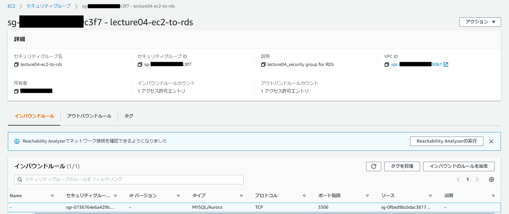

------------------------------------------------------------------------------------------------------------------
# AWS環境構築（VPC、EC2、RDS）
------------------------------------------------------------------------------------------------------------------

### 課題内容
AWS上にVPC、EC2、RDSを構築のうえEC2からRDSへ正常に接続出来ることを確認する。

### 構築した環境
1. VPC 
- VPCのウィザードを活用し、プライベートサブネット、パブリックサブネットを作成する。

2. EC2 
- Amazon Linuxのインスタンスを起動する。

- セキュリティグループを作成し、外部からEC2への接続を許可する。

3. RDS 
- MySQLを選択しRDSを起動する。

- サブネットグループでプライベートサブネットを2つ割り当て、
セキュリティグループを作成してEC2からRDSへの接続を許可する。 
  - ルール1

  - ルール2

4. EC2（MySQLクライアント） 
Amazon LinuxのインスタンスからMySQLに接続するために必要。
MySQLに必要なリポジトリをダウンロードのうえ、yumコマンドでクライアントをインストールする。

### EC2からRDSへの接続確認
RDSのエンドポイント、MySQL用のポート番号、ユーザ名を指定して接続。 
RDS作成時に設定したパスワードを入力して接続できたことを確認。
