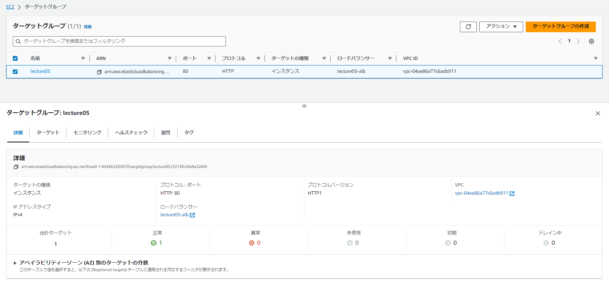

------------------------------------------------------------------------------------------------------------------
## EC2へのアプリケーションデプロイ
------------------------------------------------------------------------------------------------------------------

### 課題内容
EC2上にサンプルアプリケーションをデプロイし動作させる。
1. Pumaのみで起動
2. Nginx＋Unicornで起動
3. ELB経由で接続
4. S3を追加

### 構築した環境
- VPC、EC2、RDS、セキュリティグループなどは第4回までと同様に構築。
- EC2上にMySQLクライアント、Git、Ruby、Bundler、Node.js、yarn、Railsをインストールする。

#### 1.Pumaのみで起動 
- 実行ファイルbin/devで起動 
ポート3000番指定で接続OK 

#### 2.  Nginx＋Unicornで起動
- Unicornインストール 
Gemfileに"unicorn"の記載があるので、念のため再度`bundle install`を実行する。 
"unicorn.rb"を修正し、ファイルパスを"/var/www/raisetech～"に変更する。

- Nginxインストール 
リポジトリとNginx本体をインストールする。 "nginx.conf"を修正し、ファイルパスを"/var/www/raisetech～"に変更する。 
`nginx -t` を実行し設定ファイル上のシンタックスエラーが無いことを確認。

- Nginx起動 
`systemctl start nginx`でNginxを起動する。`systemctl staus nginx`で"running"となったことを確認。

- Unicorn起動 
`bundle exec unicorn_rails -c config/unicorn.rb`でUnicornを起動する。

- ブラウザからの接続確認 
  - ブラウザからパブリックIP指定で接続するも、HTTPのステータスコード403が返ってきている。 
Unicornのログには異常なし（infoのみ）、Nginxのログでパーミッションエラーあり。
    - 所有者＆所有グループを"nginx"に変更　→変わらず403エラー
    - SELinuxを"disabled"に変更　→解消！

  - 403エラーは解消するも、Nginxのデフォルトページが表示されアプリ起動できない。
    - nginx.confの内容を修正　→解消！ 
     ①confファイルを1つに集約　②publicディレクトリの宣言文を1つに集約 
     ③indexファイル探索の1文を明記（index.html、index.html.slim）

#### 3. ELB経由で接続

【ポイント】ALBは、ターゲットのステータスを確認するため定期的にリクエストを送る。

- ターゲットグループの設定 
[AWS公式]https://docs.aws.amazon.com/ja_jp/elasticloadbalancing/latest/application/create-application-load-balancer.html 

- ロードバランサ―の設定 
[AWS公式]https://docs.aws.amazon.com/ja_jp/elasticloadbalancing/latest/application/create-application-load-balancer.html 

- ブラウザからの接続確認 
ブラウザからDNS名指定で接続するも、"Blocked Host"のエラーが返ってきている。 
"deveropment.rb"を編集し、該当ホストとの通信を許可するよう追記　→解消！ 

#### 4. S3を追加

【ポイント】S3接続用にIAMユーザーのアクセスキーを発行し、データ保存先設定をlocalからS3に変更する。

- IAMユーザー作成・アクセスキー発行 
S3にのみ接続可能なIAMユーザーを作成し、そのアクセスキーを利用してS3に接続する。

- 画像保存先の変更 
"development.rb"を編集し、画像保存先を":local"から":amazon"に変更する。 

- credentialsファイルへのアクセスキー情報保存 
コマンドで"development.yml.enc"を新規作成し、アクセスID・アクセスキー・バケット名を追記する。 
`EDITOR=vi rails credentials:edit --environment development` 

- Image Magickインストール 
ブラウザで画像表示できるよう、EC2上へImage Magickをインストールする。

- ブラウザからの接続確認 
New fruitsボタンから画像が保存できることを確認。 
 

- S3への画像保存確認 
ブラウザから画像をアップロード・保存後、S3にデータが保存されていることを確認。 

#### 構成図

### まとめ・所感
- config系のファイルは触ることがある。慣れが必要。
- AWSの設定をする時はQiitaやブログ記事などで概要をつかみ、細かい部分はなるべくAWS公式の情報を。

- 「なぜこの手順なのか」「このパラメータの意味は何なのか」などをよく考える！ 
　また、 考えたこと・試したこと・結果をしっかり残しておく！ 
  - 多かったミス：何を試してどうなったのが分からなくなった、変更対象を勘違いしたまま突き進んでいた 
→Notionにつまづきも含めて全部メモしていく。正しい手順は右列にまとめ直すなど工夫する。