# CloudFormationでのインフラコード化

インフラのコード化・自動化はクラウドエンジニアに求められるスキル。 
コード化できれば誰でも同じ環境を作ることができ、パラメータ値を変えることで異なる複数の環境を素早く作成できる。 
ただし、パターン化できるところとできないところがあるため、どこまでをコード化・自動化できるか考える必要がある。 

## CloudFormationとは
インフラのコード化を行えるAWSサービス。 
CloudFormationではテンプレートファイルを読み込むとスタック単位で環境が構築される。 
テンプレートとスタックは1対1で紐づいており、スタックを削除すると各テンプレートによって構築した環境も削除される。 

***

## 課題内容
CloudFormation を利用して、現在までに作った環境をコード化しましょう。 

### 行ったこと
- リソース単位でテンプレートファイルを分割して作成。 

- EC2→ALBの順で構築する必要があるが、後から構築すべきALBのセキュリティグループIDをEC2構築時点でで呼び出す必要があったため 
各リソースのセキュリティグループを1つのテンプレートファイルに分けて作成。 

- RDSのパスワードはテンプレートに平文で記載せず、自動生成するように設定。接続前にコンソール上でパスワード変更する想定。

- VPC、セキュリティグループ、EC2、ALB、RDS、S3 の順でスタックを作成し、環境構築に成功。 
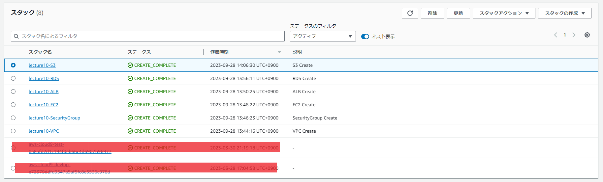  

### 構築した環境
- VPC
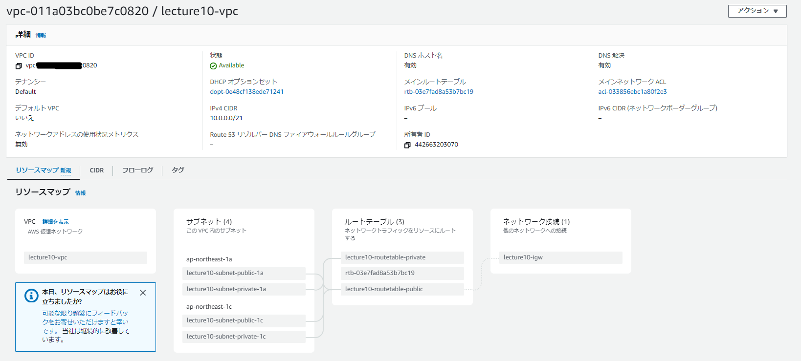  
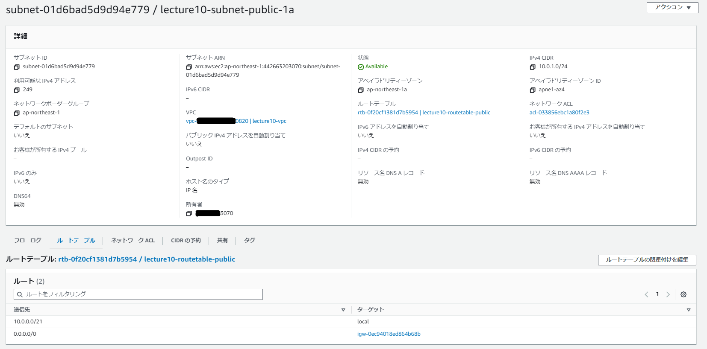  
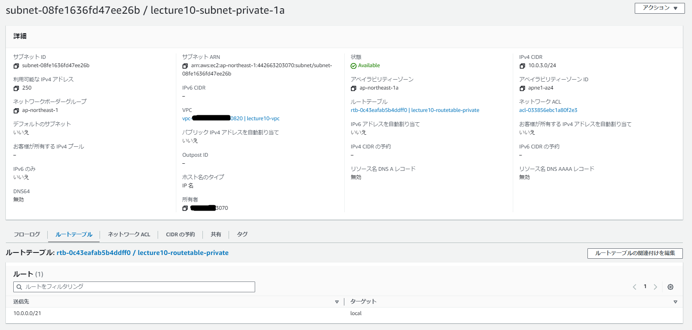  
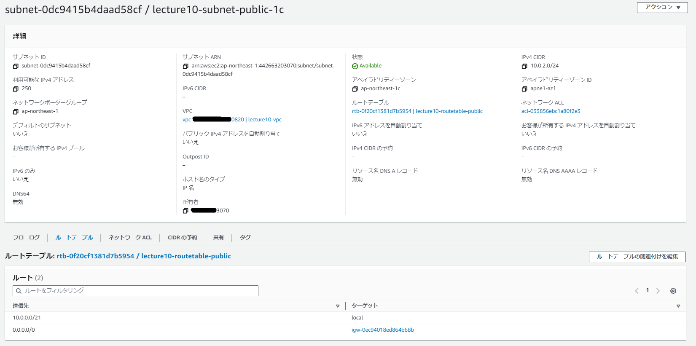  
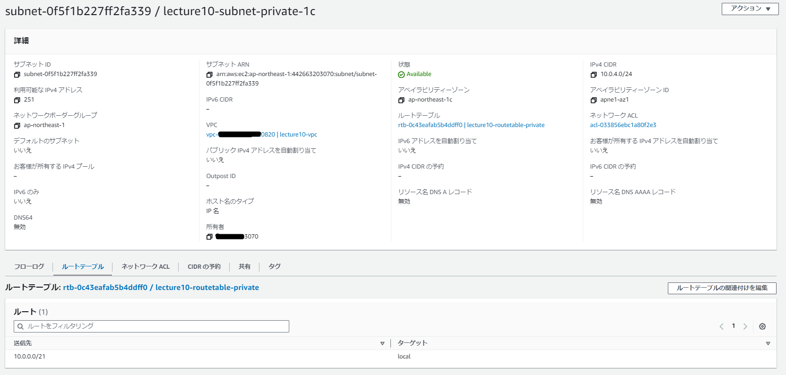  

- セキュリティグループ
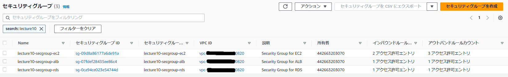  

- EC2
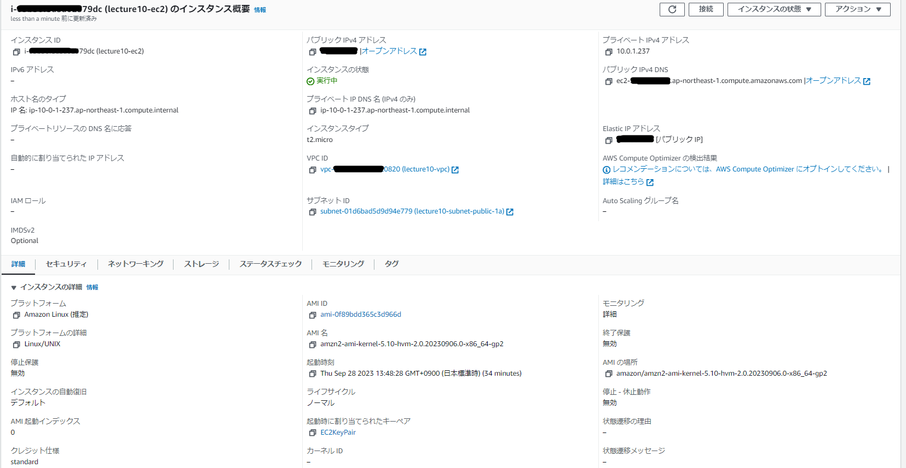 
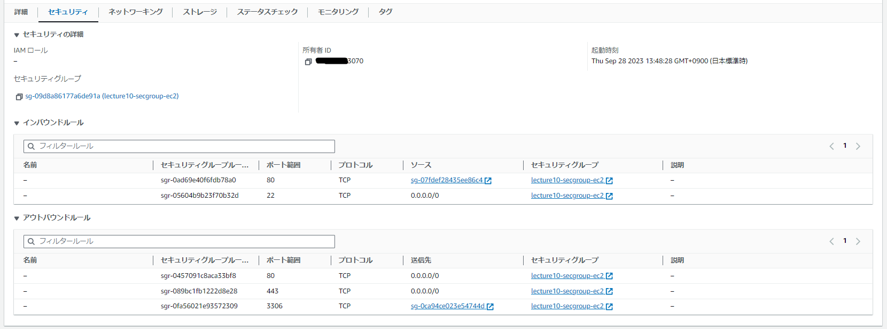  

- ALB
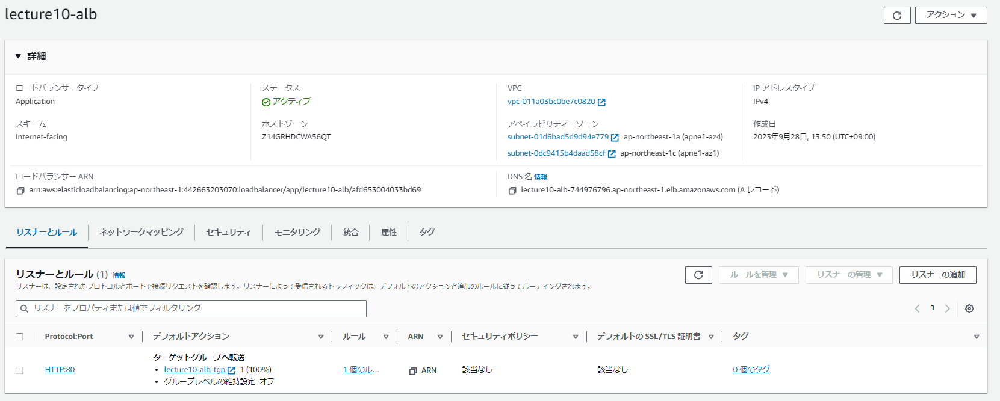  
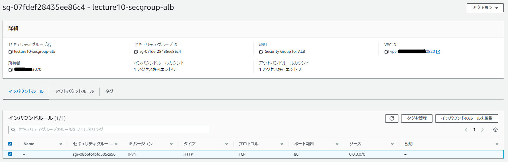  
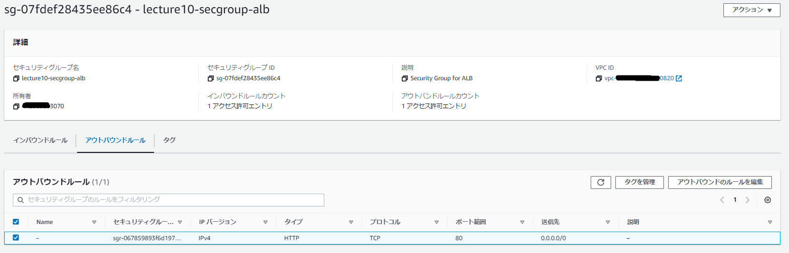  

- RDS
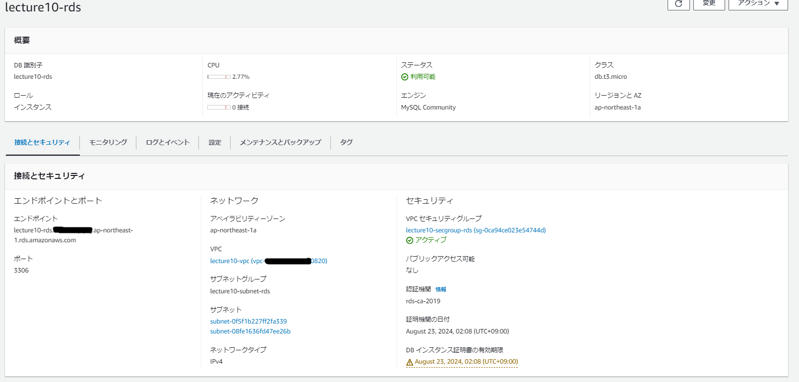 
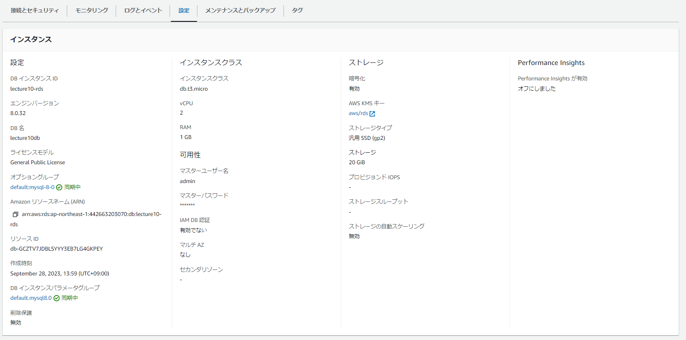 
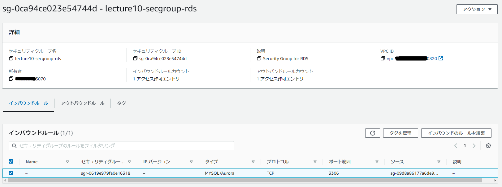  
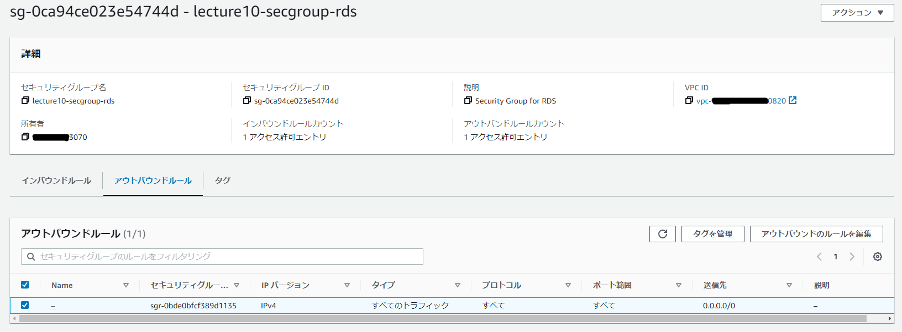 

- S3
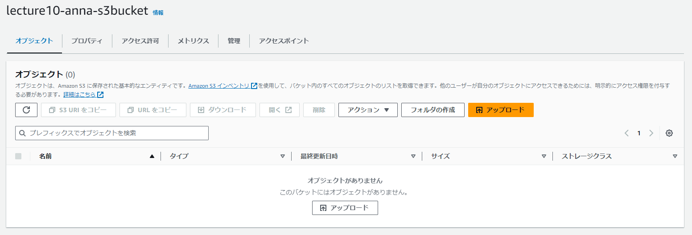 
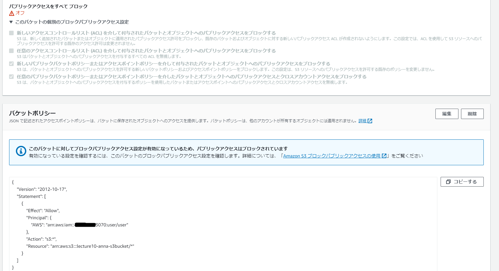 

***

## メモ

- !Ref [論理ID]：同一テンプレートファイルにあるリソースの論理IDを指定すると、決められたID値などを返す。 
  VPCの論理IDを指定すると、VPC IDを返すなど。 

- !GetAtt [論理ID].[取得したいリソース情報]：同一テンプレートファイルにあるリソースの論理IDを指定すると、決められたリソース情報を返す。 
  セキュリティグループの論理ID.グループIDを指定すると、セキュリティグループIDを返すなど。 

- !ImportValue：異なるテンプレートファイルにあるリソースの論理IDを指定すると、Export元で指定した値を返す。 
  Export元でOutputsの指定が必要。  

