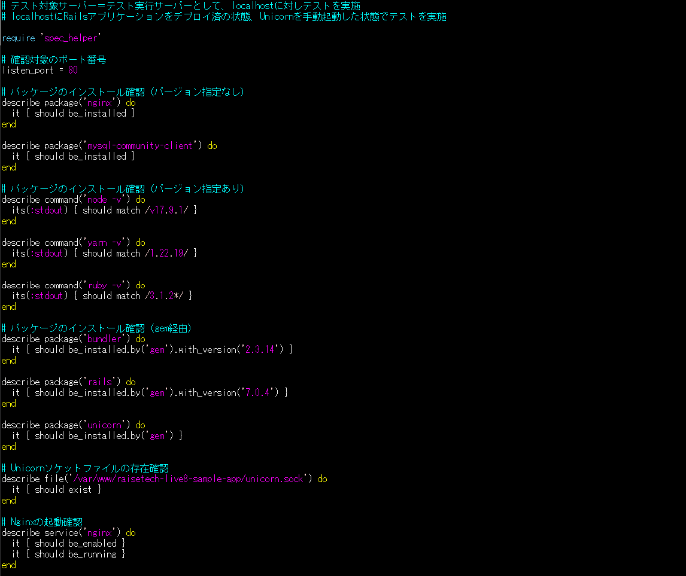
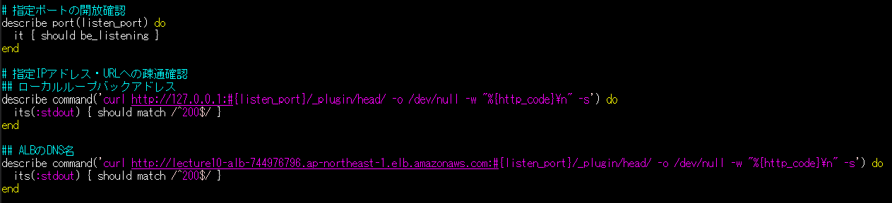
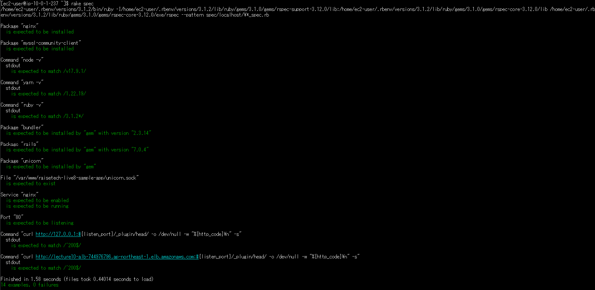

# ServerSpecを用いたテスト

ServerSpecはインフラのテストに使用するツール。たとえばテスト対象サーバーに所定のパッケージがインストール済みかどうかなど、複数のテスト項目を一括でテスト可能。  
ServerSpecをインストールしテストコードを記述すると、`rake spec`コマンドを実行するだけでテストを行うことが出来る。  
まずテスト項目を設定し、各項目のテストをクリアできるように開発・構築していくという「テスト駆動開発」の手法もある。  

## 課題内容

ServerSpecのテストが成功するように、サンプルファイルをカスタマイズしましょう。

## 行ったこと

- 第10回の課題でCloudFormationを使って作成したインフラ環境に、第5回課題と同様のRailsアプリケーションをデプロイする。

- 第10回の課題で作成したEC2に、ServerSpecをインストールする。

- `serverspec-init`コマンドで初期設定を行う。今回はテスト実行とテスト対象のサーバーを分けないためlocalhostのテストとして設定した。

- サンプルの「sample_spec.rb」をそのまま使ってテストを行う。
  - サンプルのテスト内容
    1. Nginxがインストール済みかどうか確認する。
    2. ポート番号8080番が解放されているか確認する。
    3. curlコマンドでローカルループバックアドレス宛て＆ポート番号8080番宛てにHTTPリクエストを行い、
    標準出力の値が「200」（HTTPステータスコードで「正常」の意味）と合致するか確認する。

- サンプルの「sample_spec.rb」を下記の通りに書き換えてテストを行う。

## テスト内容
- 必要なパッケージがインストールされているか、バージョン指定があるものは該当バージョンがインストールされているか。
アプリケーションの動作に必要なパッケージがそろっているか確認するため。

- Unicornのソケットファイルが存在するか。
Unicornが使える状態になっているか確認するため。

- Nginxサービスが起動されているか、常時起動の設定になっているか。
Nginxが使える状態になっているか確認するため。

- ポート80番で通信できる設定になっているか。
Nginxで利用する80番ポートで通信ができる設定になっているか確認するため。

- localhostやALBエンドポイントに対して通信できる状態になっているか。
localhost＝テスト対象サーバーが起動していて通信可能な状態かどうか確認するため。

  
 

## テスト結果

- 全項目のテストが成功したことを確認。  
 

## メモ

- curlコマンド：様々なプロトコルでデータ送受信が出来るコマンド。WebサイトへHTTPリクエストを送信してコンテンツを取得する使い方が多い。
  - 「-o」オプション：取得したコンテンツをファイル出力する。
  - 「-w」オプション：送受信が終わった後に出力するテキストを指定する。「-o」とともに使うとHTTPステータスコードのみ抜粋できる。
  - 「-s」オプション：ファイル出力時の進捗状況やエラーを非表示にする。
  
- ローカルループバックアドレス：自分自身を表す特別なIPアドレス。TCP/IPが有効なコンピュータでは常に利用可能。「127.0.0.1～127.255.255.254」の範囲であればどのIPアドレスでも利用できる。

- stdout, stderr：標準出力と標準エラー出力を指す。ディスプレイ上での文字表示が設定されることが多い。今回はファイルに書き出された標準出力の結果を使用。

