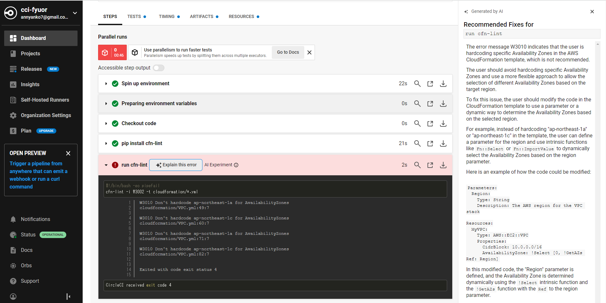
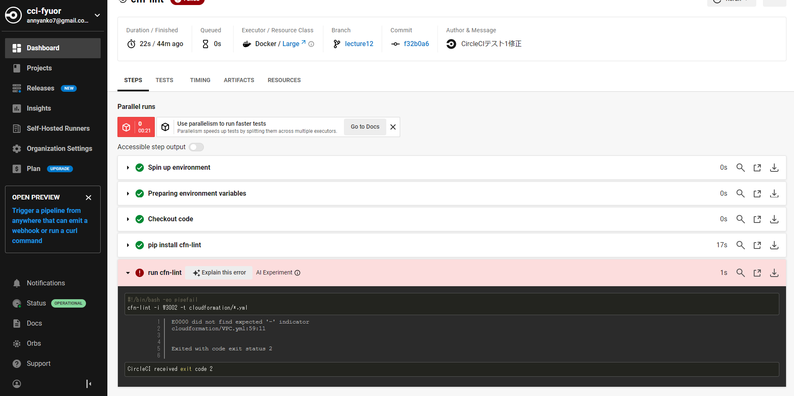
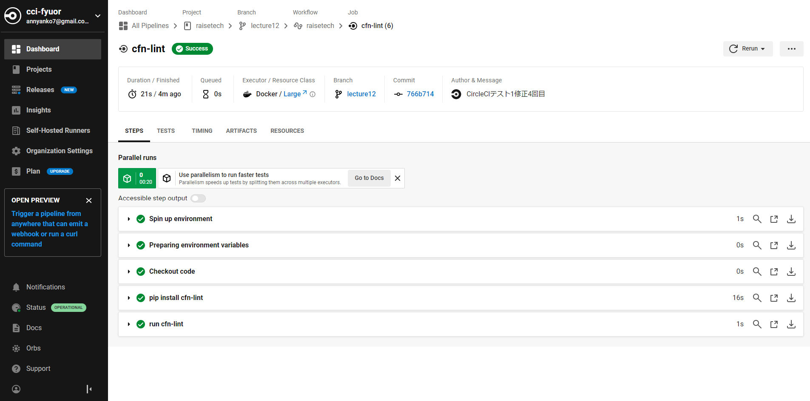

# １．DevOpsとは

開発と運用のチームを統合し、お互いの業務内容を把握し協力体制を築きながら開発・運用していくこと。  
開発時には運用を考慮した実装や環境構築を、運用時には運用で得られた知見や分析結果をリアルタイムで開発メンバーにも共有するなど。  
- 開発体制：ビルドやデプロイの自動化、ダウンタイムをゼロにする仕組みの構築、自動バックアップや復旧の自動化など  
- 運用体制：情報をリアルタイムで共有する、問題発生時のアラート通知、SNS通知、自動アクション、監視・分析ツールの利用など  

# ２．CI/CDとは

DevOpsを進めていくうえでCI/CDは重要。Continuous Integration/Continuous Deliveryの略。継続的インテグレーション、継続的デリバリー。   
アプリやインフラ環境のコードに関わる部分のテストを自動化し、常にリリース可能な状態にすることをCIと言う。リリースまで行うところを含めるのがCD。   
テストが通る＝リリースOK状態とするので、効果的なテストコードをしっかり書く必要がある。 

### CI/CDツール

CI/CDツールはジョブ機能（定型作業を自動化した小さい単位＝ジョブとする）、トリガー機能（ジョブの起動条件を指定する）、パイプライン機能（ジョブ実行とトリガー実行を一連の流れとする）を備えていることが多い。  
以前はJenkins一択だったが、最近はCircleCIやGitHub Actionsを使うケースが多く、インフラ環境がAWSならAWS Code Buildを利用できる。  
CI/CDツールは手動で実行せず、イベントトリガーを活用し自動実行する。  

## ◆課題内容

CircleCI のサンプルコンフィグを提供しますので、これが正しく動作するようにリポジトリに組み込んでください。 （＝CircleCIを利用してテストを実行する）

### 行ったこと

- CircleCIのアカウントを作成し、Githubと連携するよう設定する。 

- 課題用リポジトリ「raisetech」の直下に「.circleci」ディレクトリを作成し、「config.yml」ファイルを配置する。 

- 課題用リポジトリ「raisetech」の直下に「coudformation」ディレクトリを作成し、cfn-lintでチェックしたいymlファイルを配置する。 

- ローカルのGitでコミットとpushを行い、Githubと連動してCircleCIでテストが行われることを確認する。

- テストの結果を確認し、テスト結果が「Success」になるまでymlファイルを修正する。

### テスト内容

- cfn-lintがcloudformationディレクトリ内のymlファイルをチェックする。 

### テスト結果
- AZをハードコーディングしていたことが原因でエラーとなった。  
  

- 修正するが、関数の書き方が間違っていたことが原因でエラーとなった。形式がおかしい、「""」や「''」で囲んでしまっていたなど。  
  
  

- 何度か修正のうえ、テスト結果がSuccessになったことを確認できた。   
 

### メモ

- cfn-lint：AWS CloudFormation Linterというツールのこと。CloudFormationのテンプレートを詳しくチェックし、誤りを指摘する。  

***

# ３．Terraformとは

インフラのコード化を行うためのツール。listを使って繰り返し処理を書けるなどメリットが多数ある。  
デメリットは、CloudFormationに比べるとAWSの最新機能にすぐ追いつけないことなど。  
過去にはコード規約の変更で、インフラ環境に変更が無くてもコードの互換性がなく変更が必要になったことも。  
ただし、デメリットを上回るメリットがあり、多くの企業で採用されている。 

## Terraformハンズオンメモ

### セットアップ 
1. Terraform用のディレクトリを作成する。
2. Providerの設定を行う。
  ※Provider：Terraformと各種クラウドのAPIを取り持つ存在。アクセスキーを書く際は変数化などする。 
3. initで初期化する。  
 ※backendを追加した場合、module自体やmodule参照箇所を追加した場合もinitが必要。 
4. コードを記述し、環境構築していく。

### 使用コマンド 
`terraform fmt`  コードの整形 
`terraform validate`  構文チェック 
`terraform plan`  ドライラン 
`terraform apply`  実行　※実行フォルダ内のtfファイルすべてが対象。リソースの指定も可能。 

### 使用ファイル
- 「.tf」：コードを記述して作る設定ファイル。変数定義が可能。  
- 「.tfvars」：変数を記述する設定ファイル。「terraform.tfvars」のファイル名にすると必ず読み込まれる。  
- 「.tfstate」：applyを実行した際の状態を記録したJSONファイル。  
  ※tfstateがなくなると、どの環境をTerraformで構築したか判断できなくなるため、保管や管理が重要。  

### Backend機能
tfstateをリモートストレージで管理する機能。AWSではS3バケットに格納するのが基本。  
業務で扱う場合は、S3のバージョニングも有効にすることが多い。  
なお、排他ロックが必要な場合はDynamoDBを組み合わせて使う。  

### moduleとは
リソースや機能単位で分割したtfファイルのこと。テンプレートとしてmoduleを用意し使い回すことができ、リソースの分離が出来る。  
1. dev,stage,prodで変数ファイル用のディレクトリを分け、moduleはmodule用のディレクトリに配置  
2. moduleをリソースごとのディレクトリに分けて配置（この場合あまりmodule化する利点は無いが）　など 

### workspaceとは
Gitブランチのように別々の環境を複数構築できる仕組みのこと。  
専用コマンドでワークスペースを作成する。ワークスペースごとにtfstateが生成される。

